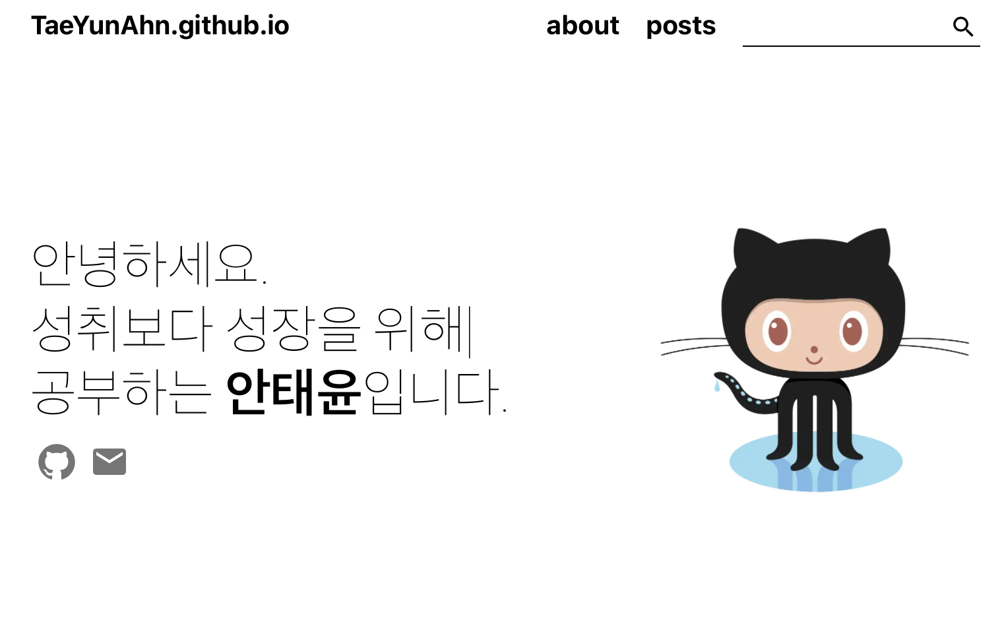
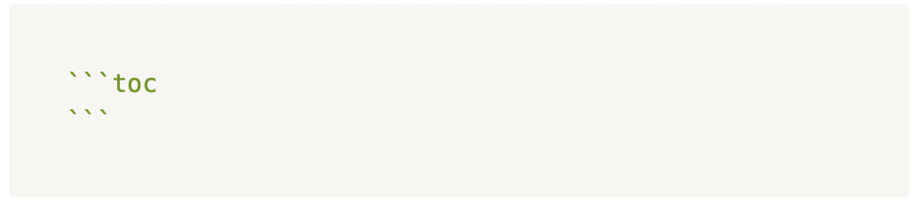

테마 적용과 게츠비 사용법은 열심히 작성했다가 다 날려먹는 바람에.. 그냥 원작자의 블로그 글을 참조하시길 바라며
테마 안에 있는 기능들과 그 기능들을 이용해 온전히 내 블로그를 만드는 방법에 대해 포스팅 해 볼까 합니다. 

---- 아래는 노션에 적었던 내용을 그대로 옮겨 적은 것으로 경어채가 사용되었으나, 향후 수정할 예정이오니 이 점 양해 부탁드립니다. ----

## 1. 블로그를 완전히 내 블로그로 만들기

레포지토리를 내려받은 디렉토리에서 gatsby-config.js를 열어 아래 코드를 자신의 블로그에 맞게 바꿔주도록 한다.

```module.exports = {
  siteMetadata: {
    siteUrl: "https://taeyunahn.github.io", //본인의 사이트 URL을 넣으면 됩ㄴ디ㅏ.
    title: "tahn_Dev_blog",
    description: 'tahn_dev_blog' // OOO의 개발블로그 
    language: 'ko', // 'ko', 'en' (영어 버전도 지원하고 있습니다.)
    ogImage: '/og-image.png', // 공유할 때 보이는 미리보기 이미지로 '/static' 하위에 넣고 싶은 이미지를 추가하시면 됩니다.
  },
  plugins: [],
};
```


## 2. utterance 를 이용해 댓글 기능 만들기

utterance 라는 기능을 이용해 댓글창을 구현하도록 해봤다.

방법은 아래 링크를 참조했는데, 깃헙 레포에 이슈를 연동해서 내 블로그에 댓글을 달 시, 깃헙 이슈에 적혀 보관되는 형태로 작동한다.

http://ccambo.github.io/FunnyLab/Blogging/change-comments-to-utterances/

1)  레포지토리가 public 인지 확인할 것

2) 레포지토리에 utterances app(https://github.com/apps/utterances) 이 설치되어 있을 것

3) fork된 레포지토리라면 세팅에서 ‘이슈’를 체크 해제 할 것.

4) 두번째 링크에서 owner/repo 형식으로 입력할 것

5) “Blog Post ↔️ Issue Mapping” 항목을 자신의 블로그 플랫폼에 맞도록 선택

6) 나온 스크립트를 본인의 블로그에 맞게 붙여주면 된다.


## 3. 글쓴이 정보

gatsby-meta-config 파일에서 author 에 입력한 정보는 홈페이지와 about 페이지 상단에 있는 글쓴이를 소개하는 섹션인 bio에서 사용된다. 나는 아래와 같이 작성했다.

```author: {
    name: `안태윤`,
    bio: {
      role: `공부하는`,
      description: ['성취보다 성장을 위해', '능동적으로 일하기 위해', '이로운 것을 만들기 위해'],
      thumbnail: 'sample.png', // Path to the image in the 'asset' folder
    },
    social: {
      github: `https://github.com/TaeYunAhn`, // `https://github.com/zoomKoding`,
      linkedIn: ``, // `https://www.linkedin.com/in/jinhyeok-jeong-800871192`,
      email: `42.4.tahn@gmail.com`, // `zoomkoding@gmail.com`,
    },
  },
```



위와 같이 바뀌는 것을 볼 수 있다.

## 4. about 페이지 만들기

똑같이 gatsby-meta-config 파일에서 각 timestamp 정보를 배열로 제공해주면 입력한 순서에 맞춰서 timestamps section에 보여지게 된다.

```bash
npm install gh-pages --save-dev
```

그리고 나서 package.json에 다음을 추가합니다.

```{
        date: '2021.5 ~',
        activity: '서울42 본과정 시작',
        links: {
          post: '',
          github: 'https://github.com/TaeYunAhn/TaeYunAhn.github.io',
          demo: 'https://42seoul.kr/seoul42/contents/view?contentsNo=13&level=2&menuNo=28&gclid=CjwKCAiAiKuOBhBQEiwAId_sK7Mg_3--lkF-pJncp70eDdfNHpJgoeR3YzuyR8WjF3oYBdB0uWx-NxoCqPAQAvD_BwE',
        },
      },
      {
        date: '2021.12 ~',
        activity: '개인 블로그 운영',
        links: {
          post: '',
          github: 'https://github.com/TaeYunAhn/TaeYunAhn.github.io',
          demo: 'https://taeyunahn.github.io',
        },
```
아직 관련 포스트는 작성하지 않아서 비어있다.


## 5. project 페이지

프로젝트 페이지 또한 마찬가지로 gatsby-meta-config 파일에서 양식에 맞게 적어주면 그동안 했던 프로잭트에 대해 간단히 설명 할 수 있는 공간을 제공한다.

```{
        title: '기술 블로그 운영',
        description:
          '그동안 많은 삽질을 통해 얻은 잡기술을 남들과 공유하기 위해 만든 블로그 입니다.',
        techStack: ['gatsby', 'react'],
        thumbnailUrl: 'blog.png',
        links: {
          post: '',
          github: 'https://github.com/TaeYunAhn/TaeYunAhn.github.io',
          demo: 'https://taeyunahn.github.io',
        },
```


## 6. 글쓰기

본격적으로 블로그에 글을 쓰려면 /content 아래에 디렉토리를 생성하고 index.md에 markdown으로 작성하면 된다.


## 7. 메타 정보

index.md 파일의 상단에는 아래와 같이 emoji, title, date, author, tags, categories 정보를 제공해야 한다.

```emoji: 🧢
title: Getting Started
date: '2021-12-27 23:00:00'
author: tahn
tags: blog
categories: blog
```

## 8. 이미지 경로

글에 이미지를 첨부하고 싶다면 같은 디렉토리에 이미지 파일을 추가해서 아래와 같이 사용하면 된다.

```jsx

```

<br/>

## 9. 목차 생성

글의 우측에 목차가 보이기 원한면 index.md 파일 맨 아래에 다음 내용을 추가하면 자동으로 목차가 생성된다.



<br/>

**위 과정을 따라하시면서 궁금하신 점이 있다면 아래 `댓글`로 남겨주세요!👇**

<script src="https://utteranc.es/client.js"
        repo="TaeYunAhn/blog-comments"
        issue-term="url"
        theme="github-light"
        crossorigin="anonymous"
        async>
</script>


```toc

```
